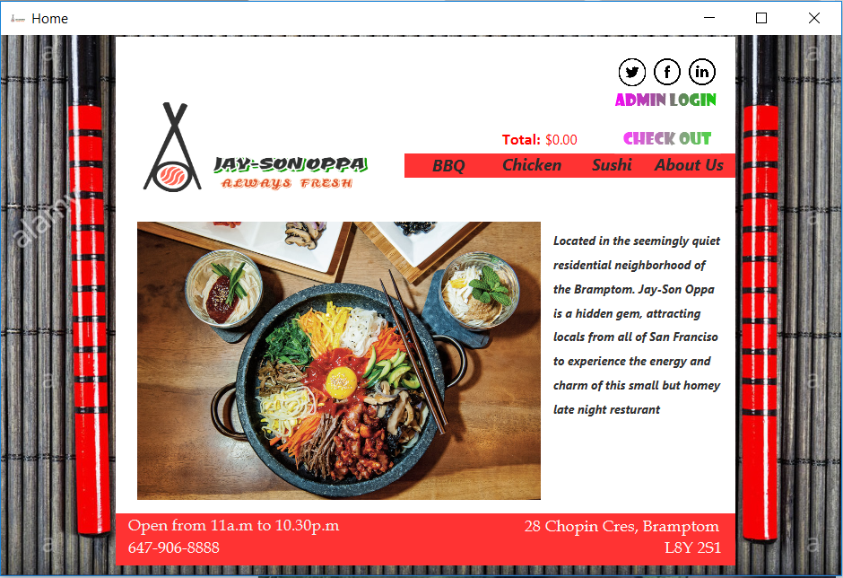
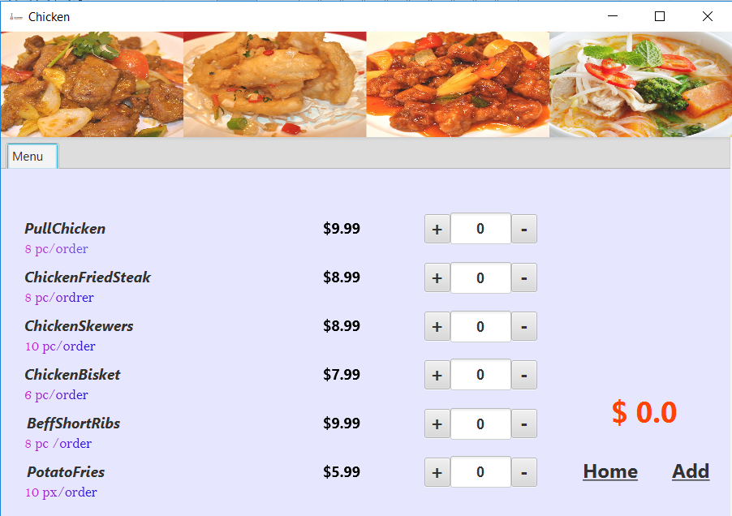
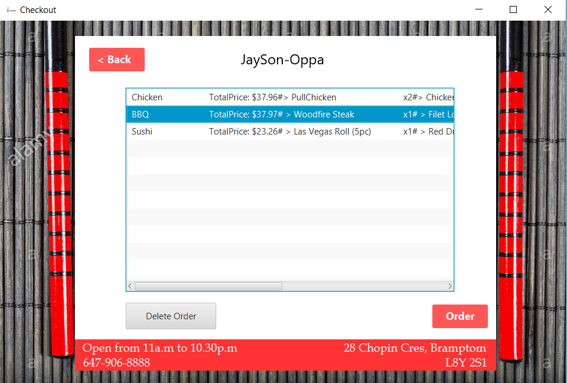
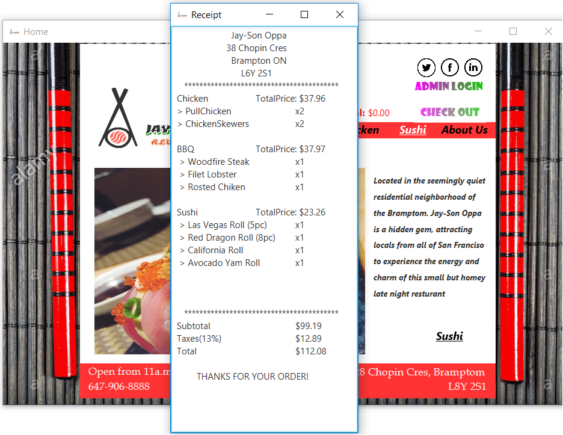

# Java-Ordering-System
Ordering System with POS

- A restaurant ordering system written in JavaSE using JavaFx as GUI.
- Utilized storing and retrieving of data in text file to act as a database in generating sales report.

  

- Pick between 3 different menus, manage the order by clicking + or -, then click add.

  

- By clicking the checkout button in the home page, you will be redirected to this page. An order can be deleted by clicking it then hitting delete order button.

  

- Finish ordering by hitting the order button. A receipt will pop out once the order is successful.

  

